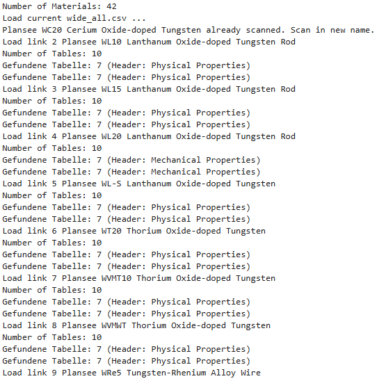
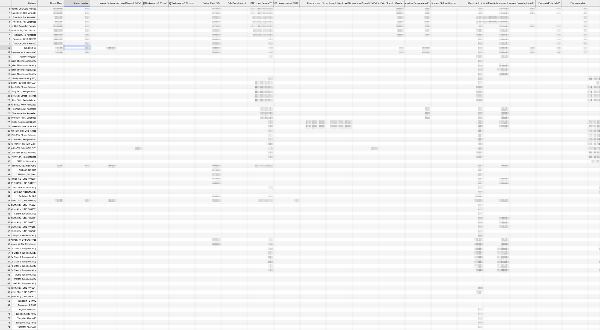
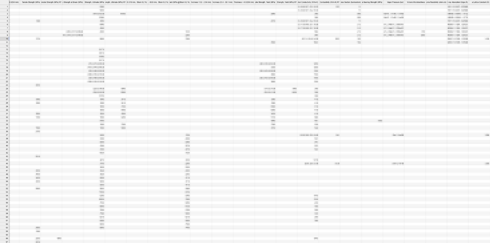

# MatWeb Material Data Extractor & Feature Engineer

This repository contains a robust Python-based data engineering pipeline designed to extract, filter, clean, and structure experimental material data directly from **MatWeb**. It automates the transition from raw HTML tables into highly structured tabular data (Wide-Format / Feature Vectors) suitable for Data Science and Machine Learning.

In this documentation data extraction has been performed on refractory metals. 

## Key Features

* **Advanced Web Scraping (Selenium WebDriver):** Connects via an existing browser session to bypass automated bot detection scripts (like Cloudflare's *"Just a moment"* page).
* **Anti-Bot Throttling:** Utilizes dynamic, randomized time delays between requests to mimic human browsing behavior and significantly reduce the risk of IP blocks or rate limits.
* **Smart Filtering:** Extracts unique URLs via BeautifulSoup from local HTML indices, with customizable exclude-term lists to filter out unwanted material grades.
* **Chemical Composition Normalization:** Features an advanced mathematical projection algorithm that parses chemical element boundaries (e.g., `≤`, `≥`, ranges) and dynamically forces the total composition to equal exactly 100.0%.
* **Wide-Format Transformation:** Flattens vertical HTML tables into single-row material feature vectors, combining physical, mechanical, electrical, and thermal properties dynamically.
* **Room Temperature (RT) Handling:** Automatically matches properties with their specific testing temperatures and handles fallback values if no temperature is provided (assigns them to specialized `RT` columns).
* **Checkpoint & Resume System:** Tracks already processed materials in a local file log to seamlessly resume extractions after exceptions or timeouts.

## Built With

* **Python 3.10+**
* **Selenium & Edge WebDriver** (for JavaScript/Session handling)
* **BeautifulSoup4** (for fast local HTML parsing)
* **Pandas** (for complex table restructuring and CSV export)
* **Regex** (for robust string parsing of units and values)

## How it Works

The pipeline is split into distinct functional steps within the Jupyter Notebook:
1. **Link Extraction:** Parses a saved MatWeb search result page to gather target `DataSheet.aspx?MatGUID=` links.
2. **Dynamic Page Loading:** Uses Selenium to load the datasheet and explicitly waits for material property headers (`Physical`, `Mechanical`, etc.) to fully load.
3. **Randomized Delays:** Applies a custom sleeping interval (e.g., `random.randint(20, 60)`) after requests to naturally buffer the scraping speed.
4. **Data Flattening (`extract_to_wide_lists`):** Parses the tables, splits values from their respective units, filters out descriptive/optical properties, and transforms rows into columns.
5. **Column Pairing:** Automatically groups property value columns directly next to their corresponding `Temperature` column.

## Browser Setup & Execution

Because MatWeb employs rigorous automated protection, the scraping process **cannot be run completely headless or from a fresh automated instance**. It must hook into a manually authenticated browser session inside your Jupyter Notebook workflow.

### 1. Launch the Browser in Debugging Mode
Before executing the Python script or running your Jupyter Notebook, you must open the Windows Command Prompt (CMD) and run the following command to launch Microsoft Edge with remote debugging enabled:

```cmd
"C:\Program Files (x86)\Microsoft\Edge\Application\msedge.exe" --remote-debugging-port=9222 --user-data-dir="C:\temp\edge_debug_profile"
```

## Results:

The following image show the program output: 

<p>
  
</p>

The follwing images are showing the data stored in a csv file. Due to copyright restrictions, the content has been obscured. 

<p>
  
</p>

<p>

</p>
